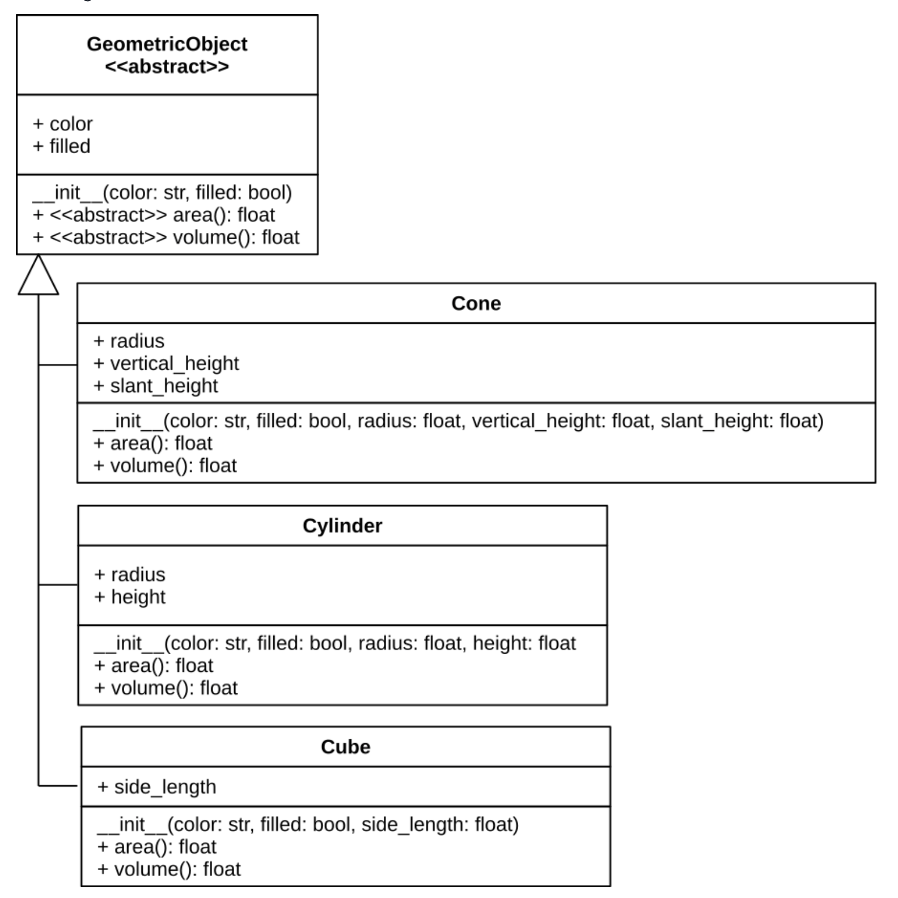
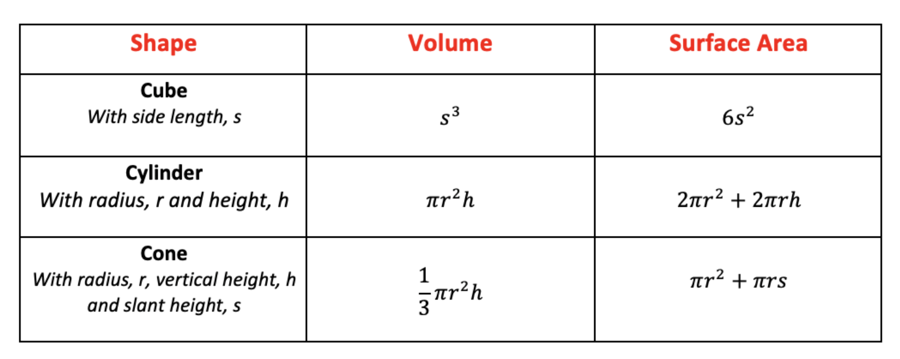

## "Abstract" methods

Before you get started on this task, here's an additional bit of information about class hierarchies.

In many cases, you will implement attributes and methods shared by all subclasses in the superclass (to avoid code duplication and simplify maintenance). However, sometimes all that is known that *all* subclasses *must* exhibit a certain kind of behavior, but the *exact* implementation is still left to the subclasses.

A good example for this is the `area` function discussed in the lecture. All `Shape`s must have an `area` method, but the exact implementation depends on the individual subclass (like `Square` or `Circle`). For this situation, we can use *abstract* methods. See the following example:

```
from abc import ABC, abstractmethod
class Shape(ABC):
    @abstractmethod
    def area(self):
        pass
```

The `@abstractmethod` annotation tells Python that the `area` method **must** be implemented in any class that inherits from `Shape`. In this case, we also need to make `Shape` inherit from `ABC`. Consequently, we need to import `ABC` and `abstractmethod` from the abc package. This makes `Shape` an *abstract* class, which cannot be instantiated (there's no way to "create a Shape", you can only "create a Circle" or "create a Square") and any class inheriting from `Shape` will need to provide an implementation for `area`.

## Geometric 3D Objects

In this task you will build a simple object-oriented hierarchy for geometric objects as per the following UML diagram.



Geometric objects have many common attributes and behaviours. They can be drawn in a certain color and be filled or unfilled. Thus a general class `GeometricObject` can be used to model all geometric objects. This generic class contains `color` and `filled` attributes. Also `GeometricObject` class contains `area()` and `volume()` methods. These methods are not implemented in the `GeometricObject` class since there is no a common formula to calculate area and volume for each geometric objects. Thus `area` and `volume` methods are *abstract* methods so they **must** be implemented in the subclasses. As a result of this *abstract* methods `GeometricObject` class becomes an *abstract* class as *abstract* classes are classes that contain one or more *abstract* methods. Be sure to indicate to Python that these methods are *abstract* by using the `@abstractmethod` annotation in the right place and also ensure the `GeometricObject` inherits form the correct class as explained above!

Special type of geometric objects can extend `GeometricObject` class in order to inherit common attributes and methods. Each special geometric object has it's unique behaviours and attributes in addition to inherited ones. For example a `cone` object has `side_length` attribute while a `cylinder` object has `radius` and `height` attributes. But both `cone` and `cylinder` objects has `color` attribute in common since they both extends `GeometricObject` class.

## Task Details

* Your task is to build the object-orietened hierarchy as per the UML diagram above.
* You should implement `Cone`,`Cube` and `Cylinder` classes.
* Each special geometric object has it's unique formula to calculate area and volume. You need to apply these formulas in the appropriate methods. You can find the formulas in the table below.

 

* `area` and `volume` functions should return `float` with *rounded* to 2 decimal points. I.e. Calculated area 19.32494 should be returned as 19.32
