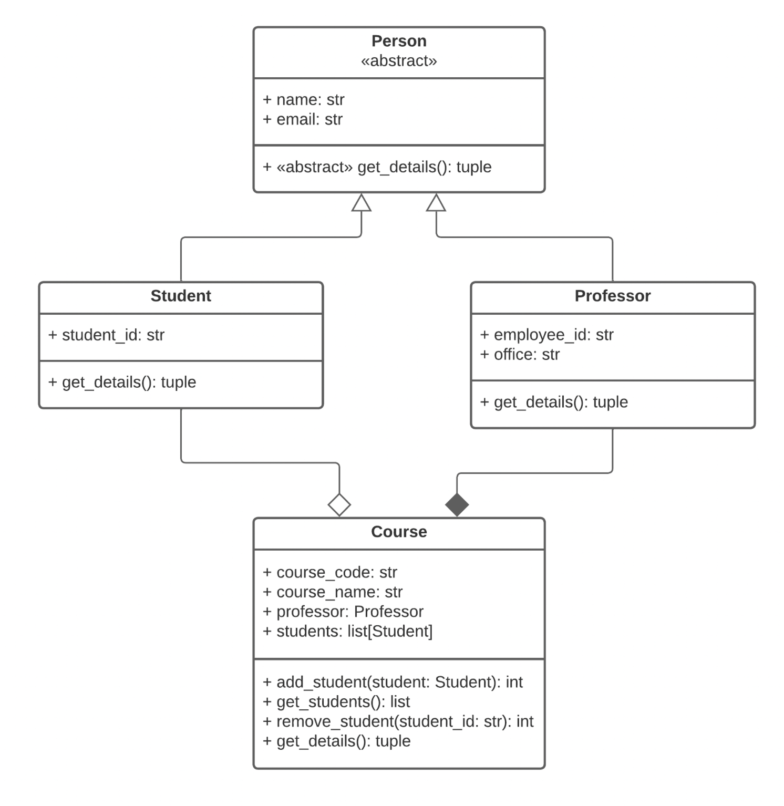

# University Course Management System

In this task, you will design and implement a set of classes to manage university courses, professors, and students.
This exercise will help you understand the concepts of object-oriented programming, including inheritance, composition, and abstract methods.
You are provided with the following class templates that you need to complete:
- person.py
- student.py
- professor.py
- course.py

Your main goal is to implement the necessary attributes and methods in these classes according to the specifications provided below.
The system is also illustrated in the following UML diagram.

---

#### 1. Person (Abstract Base Class)

The Person class is an abstract base class that represents a generic person in the university system.
It should not be instantiated directly. Methods:
- `__init__()`: Initializes the name and email attributes.
- `get_details()`: An abstract method that should be implemented by subclasses to return a tuple of the person's details.

#### 2. Student (Subclass of Person)

The Student class represents a student enrolled at the university.
- `__init__()`: Initializes the student with name, email, and student_id.
- `get_details()`: Returns a tuple containing the student's details (name, email, student_id).

#### 3. Professor (Subclass of Person)

The Professor class represents a professor teaching at the university.
- `__init__()`: Initializes the professor with name, email, employee_id, and office.
- `get_details()`: Returns a tuple containing the professor's details (name, email, employee_id, office).

#### 4. Course

The Course class represents a course offered at the university.
- `__init__()`: Initializes the course with the given code, name, professor. Also initialize students as an empty list.
- `add_student()`: Adds a Student to the course. Returns the total number of students enrolled after adding.
Raises a `ValueError` if the student is already enrolled.
- `get_students()`: Returns a list of student details for all enrolled students.
(Details are obtained by calling `get_details()` on each student object.)
- `remove_student()`: Removes a student from the course by their `student_id`. Returns the total number of students enrolled after removal.
Raises a `ValueError` if the student is not found.
- `get_details()`: Returns a tuple containing the course details (course_code, course_name, professor_details, number_of_students).
(professor_details is obtained by calling `get_details()` on the professor object.)

---

**Hint**: For the Student and Professor class; call the superclass constructor (`super().__init__()`) to initialize name and email.

**Hint:** An abstract base class extends `ABC` and adds the annotation `@abstractmethod` to abstract methods.

**Hint:** This task uses type hints to specify the expected types of variables, function parameters, and return values.
If you are not familiar with type hints, you can refer to the [Python typing module documentation][python-typing] and a [type hints cheat sheet][mypy-type-hints]. You do not have to use type hints in your solution, but given how all the signatures are already provided for you, you can just leave them in and acknowledge their existence.

**Note:** All state must be contained within the classes.
Do not store information in global variables or in class variables.
It must be possible to use multiple instances of the classes in parallel without suffering from side effects.

**Note:** The provided files define the signatures of various classes and functions.
Do not change these signatures or the automated grading will fail.

**Note:** You can freely edit `script.py`, which is not relevant for the grading.
We also strongly encourage you to add more tests to the public test suite `tests.py`.

**Note:** You have to submit four files as solution: `course.py`, `person.py`, `student.py` and `professor.py`.

[python-typing]: https://docs.python.org/3/library/typing.html
[mypy-type-hints]: https://mypy.readthedocs.io/en/stable/cheat_sheet_py3.html
